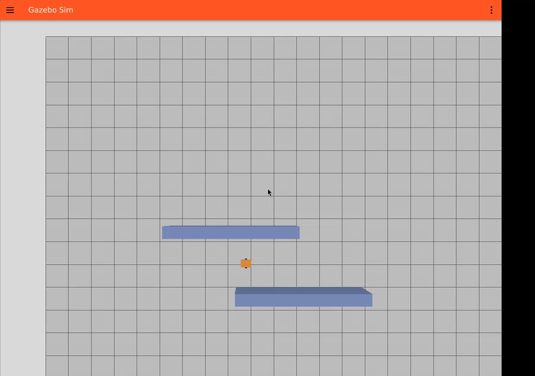
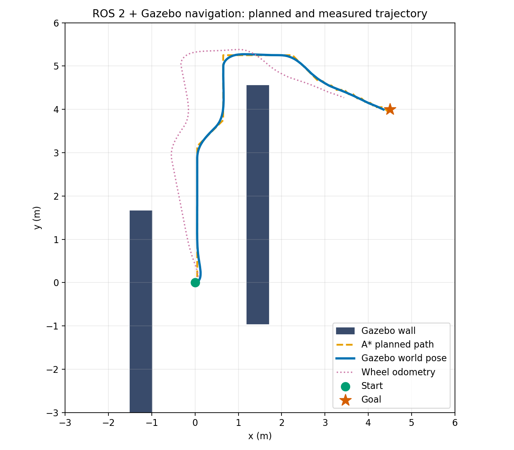
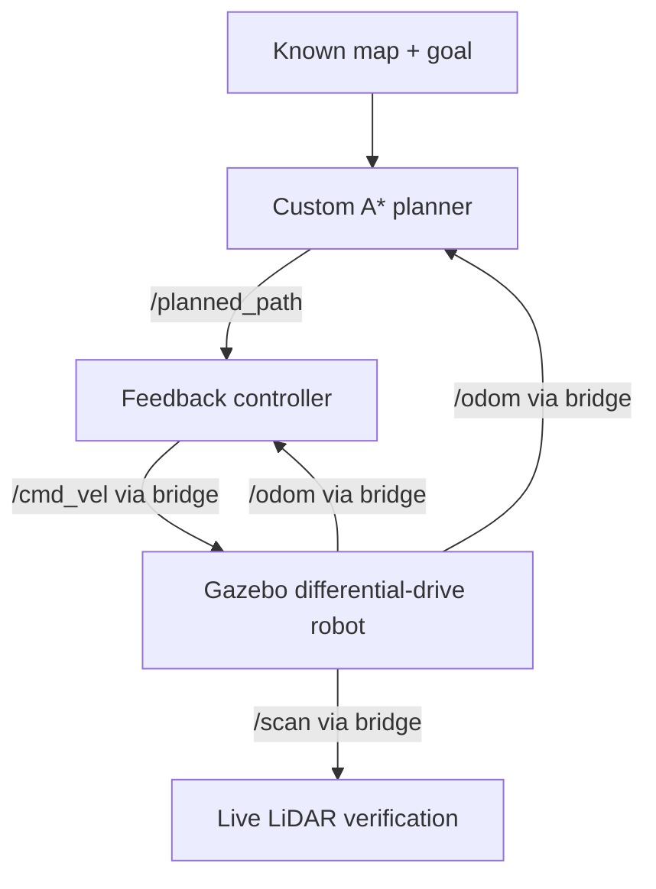

# ROS 2 Autonomous Navigation

[](https://docs.ros.org/en/jazzy/)
[](https://gazebosim.org/)
[](https://www.python.org/)
[](https://github.com/Jillian06/ros2-autonomous-navigation/actions/workflows/test.yml)

A compact robotics software project connecting a **from-scratch A\*** global planner and **feedback path follower** to a differential-drive robot in **ROS 2 Jazzy + Gazebo Harmonic**.

The design keeps planning and control simulator-independent, then integrates them through ROS 2 messages and Gazebo interfaces.

## Verified Gazebo demo

The robot physically travelled from (0, 0) m around the static walls toward (4.5, 4.0) m and stopped **0.140 m from the requested goal** in a live ROS 2 Jazzy + Gazebo Harmonic run.



*16.6-second screen recording at 3× speed. The orange robot is simulated in Gazebo; the video is captured from the running GUI.*



*Blue: Gazebo world pose. Orange: A* path. Pink: wheel odometry, which drifts under slip. The controller uses Gazebo world pose as ideal simulation localization; a localization estimator is future work.*

| Recorded output | Result |
| --- | --- |
| Physical goal error | 0.140 m |
| A* path | 92 poses |
| Gazebo world-pose messages | 1,760 |
| LiDAR scans / finite ranges | 353 / 46,701 |
| Nonzero velocity commands | 900 |
| Final linear / angular command | 0 / 0 |

[Gazebo screenshot](media/gazebo_demo.png) · [Raw ROS recording](media/demo_results.json) · [Successful integration run](https://github.com/Jillian06/ros2-autonomous-navigation/actions/runs/36685203210)

LiDAR is live and bridged to ROS. This demo plans on a known occupancy grid; scan-driven mapping and local avoidance are future work.

## Highlights

- Custom **8-connected A\*** planner on nav_msgs/OccupancyGrid
- Euclidean heuristic, obstacle rejection, and diagonal corner-cut prevention
- ROS 2 pipeline: /map + /odom + /goal_pose -> /planned_path
- Feedback waypoint tracking: /planned_path + /odom -> /cmd_vel
- Differential-drive Gazebo model with **360° 2-D LiDAR**
- ROS <-> Gazebo bridge for velocity, simulator pose, wheel odometry, and laser scans
- Deterministic demo map and goal
- Simulator-independent unit tests + GitHub Actions CI
- Architecture, algorithms, validation, and technical walkthrough docs

## Architecture



See [Architecture](docs/ARCHITECTURE.md) and [Algorithms](docs/ALGORITHMS.md).

## Repository layout

```text
.
├── autonomous_navigation/
│   ├── autonomous_navigation/   # planner, controller, ROS 2 nodes
│   ├── config/                  # ROS-Gazebo bridge
│   ├── launch/                  # navigation + simulation launch
│   ├── models/                  # differential-drive robot + LiDAR
│   ├── worlds/                  # deterministic Gazebo world
│   └── test/                    # planning/control unit tests
├── docs/
├── media/
├── scripts/
└── .github/workflows/
```

## Quick start

### Requirements

- Ubuntu 24.04
- ROS 2 Jazzy
- Gazebo Harmonic

```bash
sudo apt update
sudo apt install ros-jazzy-ros-gz ros-jazzy-rviz2 python3-colcon-common-extensions python3-rosdep
```

### Build

```bash
mkdir -p ~/ros2_ws/src
cd ~/ros2_ws/src
git clone https://github.com/Jillian06/ros2-autonomous-navigation.git
cd ~/ros2_ws
source /opt/ros/jazzy/setup.bash
rosdep install --from-paths src --ignore-src -r -y
colcon build --symlink-install
source install/setup.bash
```

### Run

```bash
ros2 launch autonomous_navigation simulation.launch.py
```

Inspect interfaces:

```bash
ros2 topic echo /planned_path --once
ros2 topic hz /odom
ros2 topic hz /scan
ros2 topic hz /cmd_vel
```

## Algorithms

### A* planning

Priority: **f(n) = g(n) + h(n)**, with Euclidean h(n), cost 1 for cardinal moves, sqrt(2) for diagonal moves, and diagonal corner cutting rejected.

### Feedback path following

The controller selects a look-ahead waypoint, computes distance and wrapped heading error, and outputs bounded linear/angular velocity. Forward speed is attenuated when heading error is large.

## Testing

```bash
./scripts/run_unit_tests.sh
```

The suite covers open-grid planning, obstacle detours, blocked goals, diagonal corner cutting, angle wrapping, and controller command behavior. See [Testing & validation](docs/TESTING.md).

## Validation status

**Live graphical Gazebo execution is verified.** The integration workflow builds the ROS package, starts the simulator, records actual ROS messages and the GUI, and checks physical arrival plus a stopped command. The seven planning/control core tests also pass.

The run observer starts before simulation launch. Both /odom and /ground_truth derive from Gazebo world pose; /wheel_odom is logged separately. Recorded observer wall time includes startup and is not a navigation benchmark. See [Testing & validation](docs/TESTING.md) and [evidence provenance](media/run_provenance.json).

## Scope

**Implemented:** known occupancy map, custom global planning, feedback path following, differential-drive simulation model, ideal simulator localization feedback, live LiDAR interface, ROS/Gazebo bridge, automated tests.

**Not claimed:** SLAM, AMCL/EKF state estimation, dynamic obstacle avoidance, learned navigation, or physical-robot deployment.

## Next steps

- Benchmark A* against Dijkstra/Nav2 baselines
- Add LiDAR-derived local obstacle updates and replanning
- Integrate SLAM Toolbox + localization
- Compare baseline tracking against pure pursuit / MPC

## License

MIT — see [LICENSE](LICENSE).
