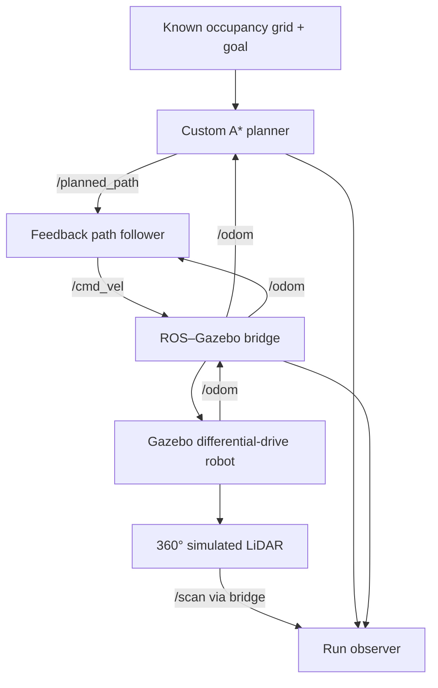

# Architecture

The demo connects a custom A* planner and feedback controller to a live Gazebo differential-drive robot through ROS 2.

## Interfaces

| ROS topic | Type | Role |
| --- | --- | --- |
| /map | nav_msgs/OccupancyGrid | Known map with inflated wall obstacles |
| /goal_pose | geometry_msgs/PoseStamped | Requested goal (4.5, 4.0) m |
| /planned_path | nav_msgs/Path | 8-connected A* result in the odom frame |
| /odom | nav_msgs/Odometry | Gazebo world pose used as ideal simulation localization |
| /cmd_vel | geometry_msgs/Twist | Bounded linear and angular commands |
| /scan | sensor_msgs/LaserScan | Live 360° LiDAR ranges from Gazebo |
| /ground_truth | nav_msgs/Odometry | Gazebo world pose for physical goal validation |
| /wheel_odom | nav_msgs/Odometry | DiffDrive wheel odometry for comparison |

The bridge sends ROS /cmd_vel to Gazebo /cmd_vel, exposes Gazebo /scan as ROS /scan, and exposes Gazebo /ground_truth as both ROS /odom and /ground_truth. DiffDrive publishes /wheel_odom separately. All planner/controller coordinates use the odom frame.

## Planning and control

The planner rejects occupied cells and diagonal corner cutting. The demo map adds clearance around the physical walls. Map, goal, and path use reliable transient-local QoS so late subscribers can receive them. Planning waits for all three inputs, including odometry arriving after the goal.

The controller follows forward look-ahead waypoints using distance and wrapped heading error. Its waypoint index progresses along the path, and it publishes zero velocity when the final waypoint is within 0.10 m.

## Sensing and scope

LiDAR is simulated, bridged to ROS, and checked for finite returns during the run. Planning uses the supplied occupancy grid; scans do not currently update the map or drive local avoidance. Gazebo world pose supplies ideal simulation localization feedback. Wheel odometry is logged separately and can drift under slip; no state estimator is implemented. SLAM, AMCL/EKF localization, dynamic obstacle avoidance, and physical-robot deployment remain future work.

## Physical model

Wheel axes are expressed in the model frame so the rotated cylindrical wheel links turn about the vehicle y-axis. Low-friction front/rear supports keep the chassis balanced. An independent Gazebo OdometryPublisher reports world pose; it provides ideal simulation localization to the controller and verifies physical arrival. This isolates planning/control integration from localization-estimator development.

## Evidence

`scripts/record_demo.py` subscribes before simulation launch and records actual ROS messages. `scripts/render_trajectory.py` plots the received path, wheel odometry, and independent Gazebo world pose against the world walls. `scripts/ci_demo.sh` captures the Gazebo desktop through Xvfb/ffmpeg and validates the recorded result. See [testing and validation](TESTING.md).
